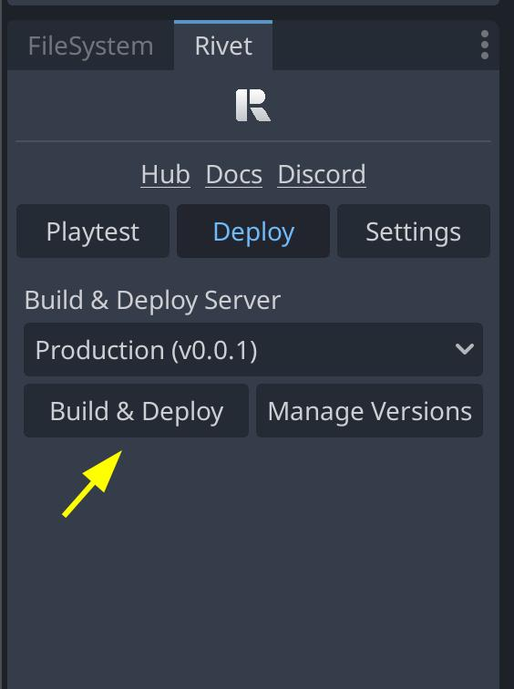
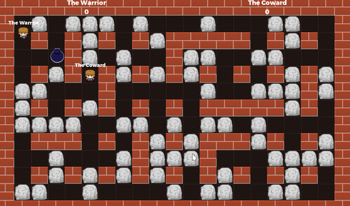
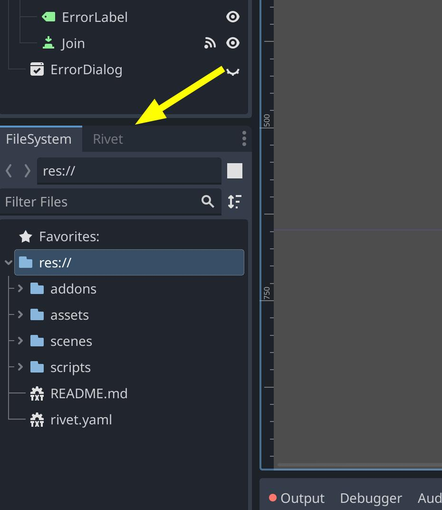

import { PreRivetBranch, WorkInProgress, InstallCli, UnfamiliarWithDockerfiles } from '/snippets/common.mdx';


<WorkInProgress/>

This guide will walk you through creating and deploying a multiplayer game with
Godot 4.2.

If you are using Godot 4.1/4.0/3.x, please be aware that some details may be different.

<Frame>
  <iframe src="https://www.youtube.com/embed/akJ6FP_DYNo" title="YouTube video player" width="100%" height="400px" allow="accelerometer; autoplay; clipboard-write; encrypted-media; gyroscope; picture-in-picture" allowfullscreen></iframe>
</Frame>

## Overview

Godot provides great multiplayer capabilities out of the box. In this tutorial,
we'll take Godot's bomber demo example and add Rivet to it. This demo uses ENet,
but it's easy to swap out for another of Godot's high-level networking APIs.



## Step 1: Clone project

<InstallCli/>

We'll be using a modified version of Godot's [multiplayer
bomber
demo](https://github.com/godotengine/godot-demo-projects/tree/master/networking/multiplayer_bomber).
First, start by cloning Rivet's example repo:

```bash
git clone -b pre-rivet https://github.com/rivet-gg/examples
cd godot/bomber
```

<PreRivetBranch/>

The demo has been refactored to try and
reduce the amount of code that will be modified for the Rivet integration.

## Step 2: Set up the Rivet plugin

If you're using the main branch of the example repo, then it will already
contain a recent version of the Rivet plugin. If you're using the `pre-rivet`,
then start by following the [installation
instructions](https://github.com/rivet-gg/plugin-godot/tree/main#installation)
on the plugin's repo.

Once the plugin is installed in Godot, you'll need to link your project with
Rivet by signing in. You can find the Rivet plugin in the same area as the
`FileSystem` window in Godot.

<Accordion title='Rivet panel missing?'>
  If you don't see it there, then something didn't load properly. You can often fix this by just reloading
  Godot with `Project > Reload Current Project`
</Accordion>



## Step 3: Update game code

### Configure Rivet

We need to create a new file to configure how our game will be run on the Rivet
Cloud. Copy the following to `rivet.json`:

```json rivet.json
{
  "engine": {
    "godot": null
  },
  "matchmaker": {
    "max_players": 12,
    "docker": {
      "dockerfile": "Dockerfile",
      "ports": {
        "default": {
          "port": 10567,
          "protocol": "udp"
        }
      }
    },
    "game_modes": {
      "default": {}
    }
  }
}
```

### Update gamestate.gd

In this tutorial, all of the code we need to change is in the `gamestate.gd` script.
Each code block below will replace part of a single function.

First, we'll start with the ready function. We need to hook up the `RivetHelper`
autoloaded script to the local `start_server` signal. This is so the plugin can
handle part of the multiplayer setup before our code does. We also need to call
`setup_multiplayer` to initialize the multiplayer system.

<Accordion title='Where did RivetHelper come from?'>
  The Rivet Godot plugin adds a few autoloaded scripts to your project. These are scripts that are available
  in any other script in the project. You can access a lot of Rivet's functionality through these scripts. It
  will help you make API calls with your projects tokens. Along with `RivetHelper`, there is also `Rivet` that
  is autoloaded.
</Accordion>

{/* prettier-ignore */}
```gdscript gamestate.gd
func _ready():
	RivetHelper.start_server.connect(start_server)
	RivetHelper.setup_multiplayer()

	multiplayer.peer_connected.connect(self._player_connected)
	# ...
```

Next, we're going to update how our code starts the server. This code will run
on the Rivet servers when your game is deployed, and so it uses the
`rivet_print` function that is part of `RivetHelper`. This makes it easier to
see logs that are about Rivet, and not about your game when you're looking in
the hub.

{/* prettier-ignore */}
```gdscript gamestate.gd
func start_server():
	print("Starting server on %s" % DEFAULT_PORT)

	peer = ENetMultiplayerPeer.new()
	var error = peer.create_server(DEFAULT_PORT, MAX_PEERS)
	RivetHelper._assert(!error, "Could not start server")
	multiplayer.set_multiplayer_peer(peer)
	var response = await Rivet.matchmaker.lobbies.ready({})
	if response.result == OK:
		RivetHelper.rivet_print("Lobby ready")
	else:
		RivetHelper.rivet_print("Lobby ready failed")
		OS.crash("Lobby ready failed")
```

Note that in the code above, we use the Rivet matchmaker with
`Rivet.matchmaker.lobby.ready()`. This is a part of Rivet's API, you can read
docs about [all of the matchmaker endpoints](https://rivet.gg/docs/matchmaker).
This call will tell Rivet that the server is ready to accept players. Later,
we'll call `Rivet.matchmaker.lobby.setClosed()` to tell Rivet that the lobby is
closed and no more players can join.

<Accordion title='How do I know which function to call?'>
  Each endpoint under the API section of that webpage has a similar path with the Godot plugin, say
  `Rivet.matchmaker.players.connected` would refer to [this
  endpoint](https://rivet.gg/docs/matchmaker/api/players/connected).
</Accordion>

Continuing with the new code, we'll update how the game client connects to a
server. We're first going to add code that will use Rivet's matchmaker to find a
lobby to join. Next, if the response is `OK`, we'll connect to the server using
the `port` that was returned from the matchmaker.

<Accordion title='What is response?'>
  Every API call that you make with Rivet will return a response object. This
  object will have a `result` field, and we can check if it is equal to `OK`.
  Godot has a built-in `OK` constant that is equal to `0`, so this is the same
  as checking if `response.result == 0`. If the result is `OK`, then the `body`
  field will contain the response body, and we can continue as expected.

On the other hand, if the result is not `OK`, then the `body` field will
contain an error message. Above, we chose to crash the game if the result was
not `OK`. This was because in this case it would be better for the game to
crash and for us to be able to see the error message in the logs, rather than
trying to continue. However, this might not be the best choice for your game.

</Accordion>

{/* prettier-ignore */}
```gdscript gamestate.gd
func join_game(new_player_name):
	print("Joining game as %s" % new_player_name)
	player_name = new_player_name

	var response = await Rivet.matchmaker.lobbies.find({
		"game_modes": ["default"]
	})

	if response.result == OK:
		RivetHelper.set_player_token(response.body.player.token)

		var port = response.body.ports.default
		print("Connecting to ", port.host)

		peer = ENetMultiplayerPeer.new()
		var error = peer.create_client(port.hostname, port.port)
		RivetHelper._assert(!error, "Could not start server")
		multiplayer.set_multiplayer_peer(peer)
	else:
		print("Lobby find failed: ", response)
		game_error.emit(response.body)
```

Finally, the last thing we need to do is tell Rivet that the lobby is closed
after the game is started. This makes sense for this game, since we don't want
players to be able to join a game that has already started. However, other games
might want to leave the lobby open so that players can join mid-game.

```gdscript gamestate.gd
@rpc("any_peer")
func begin_game():
	if !multiplayer.is_server():
		return
	# Tell Rivet that this lobby is closed
	await Rivet.matchmaker.lobbies.setClosed({})

	load_world.rpc()
	var world = get_tree().get_root().get_node("World")
```

{/* prettier-ignore */}
{/* 
TODO: This is being removed until the buttons are added in the plugin to start a
local server. A tracking issue can be found here:
https://github.com/rivet-gg/plugin-godot/issues/41

### Test locally

First, we can test that the game works locally.

Open the Rivet panel in the bottom left and click _Start Server_. Then click the
play button in the top right to start the client. You should be able to join the
lobby. \*/}

## Step 4: Deploy to Rivet

### Write Dockerfile

Add the following to `Dockerfile`:

<UnfamiliarWithDockerfiles />

```docker Dockerfileą
FROM ghcr.io/rivet-gg/godot-docker/godot:4.2.1 AS builder
WORKDIR /app
COPY . .
RUN mkdir -p build/linux \
    && godot -v --export-release "Linux/X11" ./build/linux/game.x86_64 --headless

FROM ubuntu:22.04
RUN apt update -y \
    && apt install -y expect-dev \
    && rm -rf /var/lib/apt/lists/* \
    && useradd -ms /bin/bash rivet

COPY --from=builder /app/build/linux/ /app

# Change to user rivet
USER rivet

# Unbuffer output so the logs get flushed
CMD ["sh", "-c", "unbuffer /app/game.x86_64 --verbose --headless -- --server | cat"]
```

<Accordion title='What does this Dockerfile do?'>
    A few notes about this file:

    - We use a `godot:4.2` image that comes from Rivet's GitHub registry. This
    has been pre-built with export templates so that we don't need to download
    them every time.
    - We make Godot export the game. This is done in the first image, and then
    copied to the second image. This is so that the image we deploy is smaller,
    since it won't include everything needed to compile the game.
    - We install `expect-dev` so that we can use `unbuffer` to make sure that
    the logs get flushed to stdout. This makes sure that even if the game
    crashes, we'll be able to see the logs.

</Accordion>

### Deploy game server

Now that we've prepared the game to be built with Rivet integrated, we can
deploy it to the Rivet Cloud.

<Accordion title='Where should I deploy to?'>
    When deploying, you have several options of namespaces to choose from:

    - `Staging`: Choose this namespace when you want to do a playtest of your
    game. This is a good way to make sure that networking is working as
    expected, to make sure a build works, or to try out a new feature with some
    friends.
    - `Production`: Choose this namespace when you want to release a version of
    your game. Deploying to this namespace won't affect currently-running
    lobbies, but will affect new lobbies that are created.
    - \<anything else\>: You might like to create separate namespaces for a few
    different reasons. You might have separate developers each needing their
    own, or you might have different versions of the game that should each be
    deployed separately.

</Accordion>

In the Rivet plugin, we can go to the deploy tab, and select "Staging" from the
dropdown. Then, click "Build & Deploy". This will build the Dockerfile we just
created, and upload the Docker image to Rivet's servers.



### Deploy game client

Now that we've deployed the game to Rivet, we can build a game client that will
be able to connect to Rivet. First, we need to specify which server we want to
connect from the "Playtest" tab. To use the settings that we deployed the server
with above, we need to select "Rivet servers", and set the namespace to
"Staging".

Note that changing anything under the "Playtest" tab will require
rebuilding or restarting the game, since the tokens are only set when the game
is starting. This is also something to verify when shipping builds, you don't
want to upload a version to Steam that tries to connect to your Staging server!

To build the client we can either build through Godot's export system, or simply
run the game from the editor. Both are configured to get the tokens needed for
the namespace you have set. You don't need to change anything with how you would
export the game normally for this to work!

## Conclusion

You're all done!
