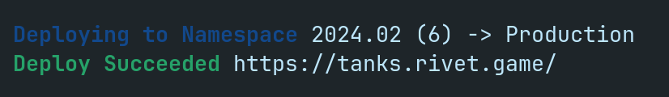

| Language                                      | Rendering                                                             | Networking                      |
| --------------------------------------------- | --------------------------------------------------------------------- | ------------------------------- |
| [TypeScript](https://www.typescriptlang.org/) | [Canvas](https://developer.mozilla.org/en-US/docs/Web/API/Canvas_API) | [Socket.io](https://socket.io/) |

The following guide will walk you through integrating and deploying a game with Rivet.

## Step 1: Setup project

Run the following to clone the repository and start the server:

```bash
git clone -b pre-rivet https://github.com/rivet-gg/examples
cd javascript/tanks-socketio-canvas
npm run start
```

<PreRivetBranch></PreRivetBranch>

This will open your browser to http://localhost:8080. Verify the game works.

### Initialize project

<InstallCli />

Run the following command to setup your project:

```bash
rivet init --html5
```

<WhatDoesRivetDo />

### Update the config

You can configure your game's Rivet config in the created `rivet.yaml` file. For the purposes of this demo,
you can copy and paste this config into your file:

```yaml rivet.yaml
scripts:
  start: npm run start

# How the game lobbies run and how players connect to the game.
#
# https://docs.rivet.gg/matchmaker/introduction
matchmaker:
  # How many players can join a specific lobby.
  #
  # Read more about matchmaking: https://docs.rivet.gg/matchmaker/concepts/finding-lobby
  max_players: 32

  # The hardware to provide for lobbies.
  #
  # Available tiers: https://docs.rivet.gg/serverless-lobbies/concepts/available-tiers
  tier: basic-1d1

# Which regions the game should be available in.
#
# Available regions: https://docs.rivet.gg/serverless-lobbies/concepts/available-regions
matchmaker:
  regions:
    atl: {}
    fra: {}

  # Runtime configuration for the lobby's Docker container.
  docker:
    # If you're unfamiliar with Docker, here's how to write your own
    # Dockerfile:
    # https://docker-curriculum.com/#dockerfile
    dockerfile: Dockerfile

    # Which ports to allow players to connect to. Multiple ports can be defined
    # with different protocols.
    #
    # How ports work: https://docs.rivet.gg/serverless-lobbies/concepts/ports
    ports:
      default:
        port: 3000

  # What game modes are available.
  #
  # Properties like `max_players`, `tier`, `dockerfile`, `regions`, and more can
  # be overridden for specific game modes.
  game_modes:
    default: {}

# How Rivet CDN should host your static assets on our CDN.
#
# https://docs.rivet.gg/cdn/introduction
cdn:
  # Command to run before uploading the site to Rivet. This can be used to
  # build any JavaScript bundles or generate assets.
  build_command: npm install && npm run build:client:prod

  # The folder to upload to Rivet.
  #
  # If you're hosting a website, ensure that `index.html` is in the root of
  # this folder.
  build_output: ./dist/

kv: {}

identity: {}
```

## Step 2: Integrate Rivet Matchmaker

### Install `@rivet-gg/api`

Run the following to install the library to interact with Rivet:

```bash
npm i @rivet-gg/api --save
```

### Update the client

Add the following to the top of `client/Client.ts`:

```typescript client/Client.ts
import { RivetClient } from '@rivet-gg/api';
const RIVET = new RivetClient({ token: process.env.RIVET_TOKEN });
```

<EnvTokenClient />

Find the `connect` function in `client/Client.ts` and replace it with the following:

```typescript client/Client.ts
async function connect(client: Client) {
  // Find a lobby to connect to on Rivet
  let res = await RIVET.matchmaker.lobbies.find({ gameModes: ['default'] });
  let port = res.ports['default'];

  // Open a new connection to the lobby
  client.connection = new Connection(client, port.isTls, port.host, {
    token: res.player.token
  });
}
```

### Update the server

Add the following to the top of `server/index.ts`:

```typescript server/index.ts
import { RivetClient } from '@rivet-gg/api';
const RIVET = new RivetClient({ token: process.env.RIVET_TOKEN });

// Notify Rivet that this lobby is ready to accept players
RIVET.matchmaker.lobbies.ready();
```

<EnvTokenServer />

Find the `setupConnection` function in `server/index.ts` and replace it with the following:

```typescript  server/index.ts
async function setupConnection(socket: Socket) {
  // Read the token passed to the socket query
  let playerToken = socket.handshake.query.token as string;

  // Validate the player token with the matchmaker
  await RIVET.matchmaker.players.connected({ playerToken });

  // Remove the player when disconnected
  socket.on('disconnect', () => RIVET.matchmaker.players.disconnected({ playerToken }));

  new Connection(game, socket);
}
```

### Run with Rivet

Finally, after stopping the previous `npm run start`, run `rivet run start` and validate the game still connects.

<Accordion title='What is "rivet run"?'>
  The `rivet run` command automatically adds important environment variables required for running a game to
  whatever script you choose to run with it. In this case, it is reading the `start` script defined in
  `rivet.yaml`.
</Accordion>

<Accordion title='Optional: Check for connectivity to Rivet'>
  1. Press `Ctrl + Shift + I` (or `Cmd + Option + I` on macOS) to open the dev tools.
  2. Navigate to the "Network" tab.
  3. Refresh your page.
  4. Find a `POST` request to `https://api.rivet.gg/matchmaker/lobbies/find`. This means you are
    successfully connected through Rivet.

  
</Accordion>

## Step 3: Deploy to Rivet

Now that you managed to get the game running locally, you can deploy your game to Rivet with:

```bash
rivet deploy prod
```

<Accordion title='What does this do?'>
  - Builds & uploads your Docker image for [Rivet Dynamic Servers](/docs/dynamic-servers/index) - Builds &
  uploads your site for [Rivet CDN](/docs/cdn) - Creates a version on Rivet and deploys the version to the
  *Production* namespace
</Accordion>

The CLI will print a link ending in `rivet.game`. Share the link with a friend to play your game on Rivet! 🎉


